# Lynk - Modern Real-Time Chat App with Django REST API & WebSocket

Lynk Chat is a modern, feature-rich web-based chat application designed for real-time messaging, media sharing, and seamless user experience. The frontend is built with HTML, CSS (Bootstrap 5), and JavaScript, and is highly interactive and responsive.  
The backend is powered by Django, utilizing Django REST Framework for API endpoints and Django Channels for real-time WebSocket communication, enabling secure authentication, efficient data management, and instant messaging features.

---

## Features

### 1. **Splash Screen**
- Animated splash screen with the Lynk logo and infinity animation.
- Provides a visually appealing loading experience.

### 2. **User Authentication**
- Login/logout functionality (integration with backend required).
- User profile management, including profile picture cropping and editing.

### 3. **Chat List**
- Displays all user conversations in a scrollable sidebar.
- Each chat shows:
  - User avatar and name.
  - Last message preview (single line, ellipsis for overflow).
  - Timestamp of the last message.
- Active chat is highlighted.

### 4. **Chat Window**
- Displays messages in a conversation with clear sender/receiver distinction.
- Message bubbles with:
  - Text, emoji, and media support.
  - Read/delivered receipts (single/double/green ticks).
  - Reply preview and reply-to navigation.
  - Message options: reply, delete, etc.
- Typing indicator animation when the other user is typing.

### 5. **Message Input**
- Multi-line message input with auto-resize (max height).
- Emoji picker for easy emoji insertion.
- File attachment support (images, videos, audio, documents).
- Voice message recording with live waveform and controls.
- Reply preview bar above the input when replying to a message.

### 6. **Media Viewer**
- Full-screen modal for viewing images and videos.
- Zoom and pan support for images.
- Easy close button.

### 7. **Friends Management**
- Add/search friends by username or email.
- Accept/reject friend requests.
- View and manage friend list.

### 8. **Modals and Popups**
- Video and audio call modals with user info and call controls.
- Profile editing modal with image cropping (using Cropper.js).
- Delete message confirmation modal.
- Media viewer modal for images/videos.

### 9. **Responsive Design**
- Fully responsive layout for desktop and tablet.
- Scrollable chat list and chat body.
- Chat footer/input always visible and fixed at the bottom.

### 10. **Accessibility & UX**
- Keyboard navigation support.
- ARIA labels for important elements.
- Visual feedback for actions (hover, active, etc.).

---

## How to Run

1. Open `dashboard.html` in your web browser.
2. Ensure you have an active backend server for real-time messaging (WebSocket or REST API).
3. Update API endpoints and WebSocket URLs in the JavaScript as needed.

---

## Technologies Used

- **HTML5 & CSS3** (with Bootstrap 5)
- **JavaScript (ES6+)**
- **FontAwesome** for icons
- **Cropper.js** for image cropping
- **Google Fonts** for typography

---

## Customization

- Update the logo and branding in the splash screen and header.
- Adjust color schemes in the CSS to match your brand.
- Integrate with your backend for authentication, messaging, and media storage.

---

## Using Django as the Backend

This chat application's frontend is designed to work seamlessly with a Django backend. Here’s how REST API and WebSocket are typically used with Django:

---

### REST API with Django

- **Framework:** [Django REST Framework (DRF)](https://www.django-rest-framework.org/) is commonly used to build RESTful APIs in Django.
- **Use REST API for:**
  - User authentication (login, logout, registration)
  - Fetching chat history and user profiles
  - Managing friends (add, remove, list)
  - Uploading and downloading media files
  - Profile updates and settings

**Example Endpoints:**
- `POST /api/login/` — User login
- `GET /api/chats/` — List all chats
- `GET /api/messages/?chat_id=123` — Get messages for a chat
- `POST /api/friends/add/` — Add a friend
- `POST /api/profile/update/` — Update user profile

---

### WebSocket with Django

- **Framework:** [Django Channels](https://channels.readthedocs.io/en/stable/) is the standard way to add WebSocket support to Django.
- **Use WebSocket for:**
  - Real-time chat messaging (send/receive messages instantly)
  - Typing indicators
  - Read/delivered receipts
  - Live presence (online/offline status)
  - Call signaling (for audio/video calls)

**Example WebSocket URL:**
- `ws://yourdomain.com/ws/chat/<room_id>/`

**How it works:**
- The frontend opens a WebSocket connection to the Django Channels server.
- When a user sends a message, it is sent over the WebSocket and broadcast to all participants in the chat room.
- Typing indicators and read receipts are also sent in real-time via WebSocket.

---

### Typical Integration Flow

1. **User logs in** via REST API (`/api/login/`).
2. **Frontend fetches chat list and history** via REST API.
3. **Frontend opens a WebSocket connection** for real-time messaging.
4. **Messages, typing, and presence** are handled instantly via WebSocket.
5. **Media uploads, profile changes, and friend management** use REST API.

---

### Example: Sending a Message

- **REST API:** Used to fetch previous messages when opening a chat.
- **WebSocket:** Used to send a new message and receive new messages instantly.

---

### Summary Table

| Feature                | Django REST API | Django Channels (WebSocket) |
|------------------------|:--------------:|:--------------------------:|
| Login/Logout           |       ✔        |                            |
| Fetch chat history     |       ✔        |                            |
| Send/receive messages  |                |             ✔              |
| Typing indicator       |                |             ✔              |
| Read receipts          |                |             ✔              |
| Profile update         |       ✔        |                            |
| Friend requests        |       ✔        |                            |
| Live call signaling    |                |             ✔              |

---

**For more details, see:**
- [Django REST Framework](https://www.django-rest-framework.org/)
- [Django Channels](https://channels.readthedocs.io/en/stable/)

---

## Screenshots

**Application**

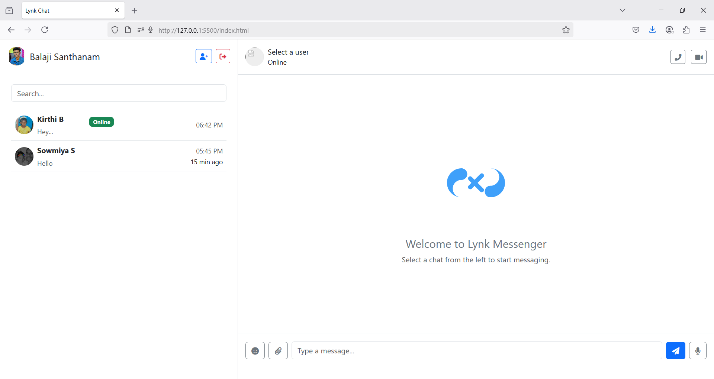

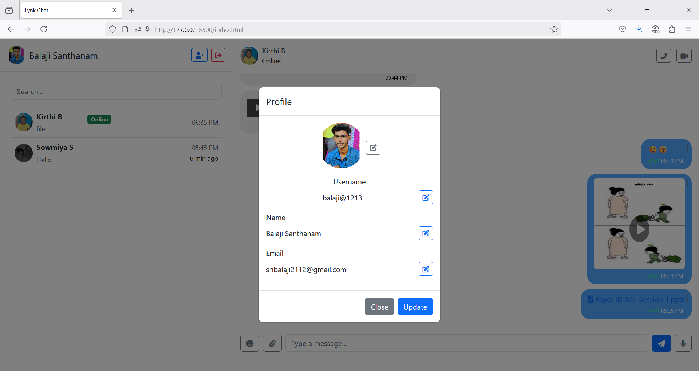

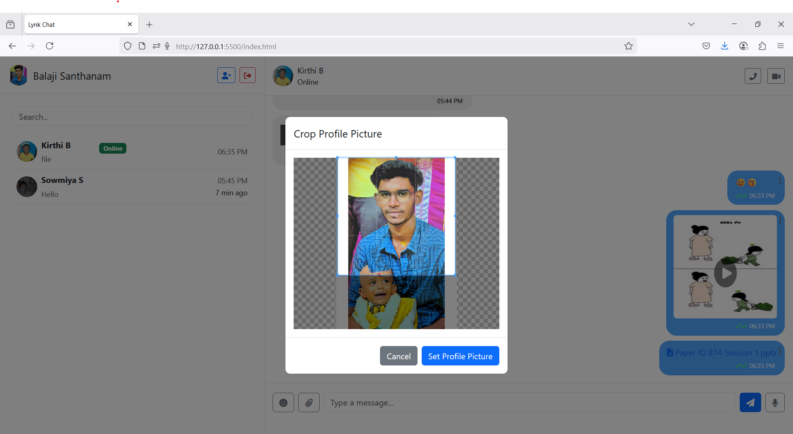

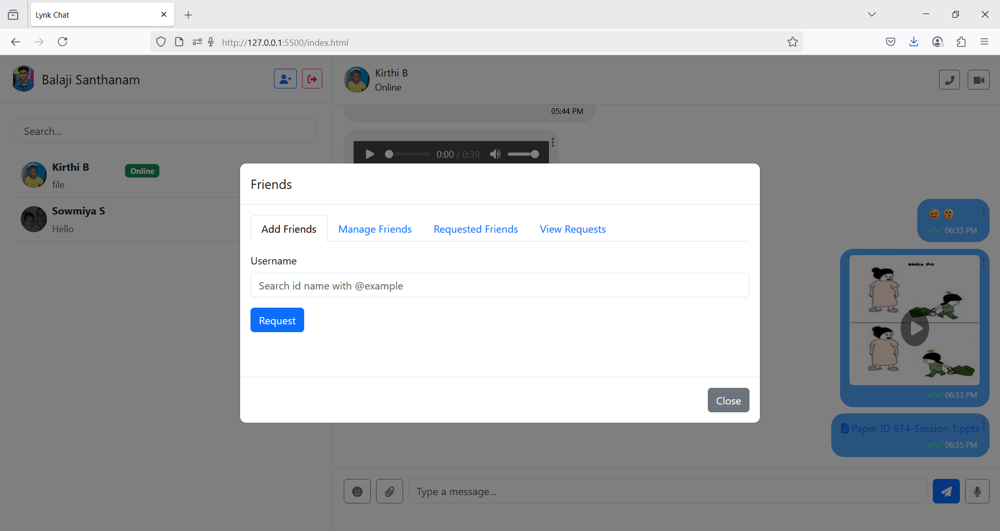

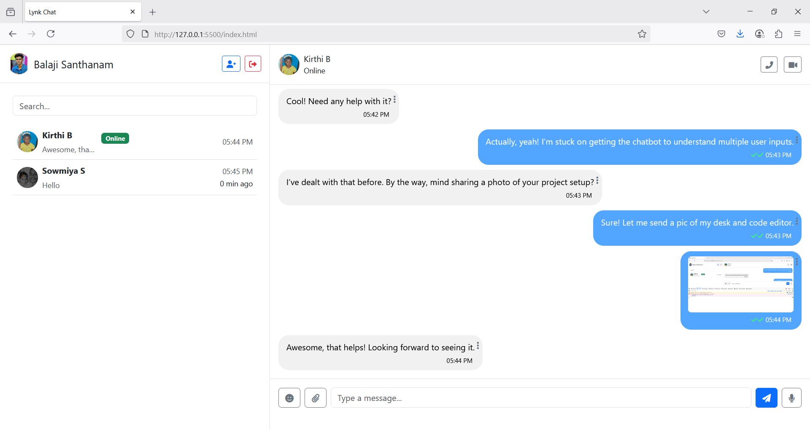

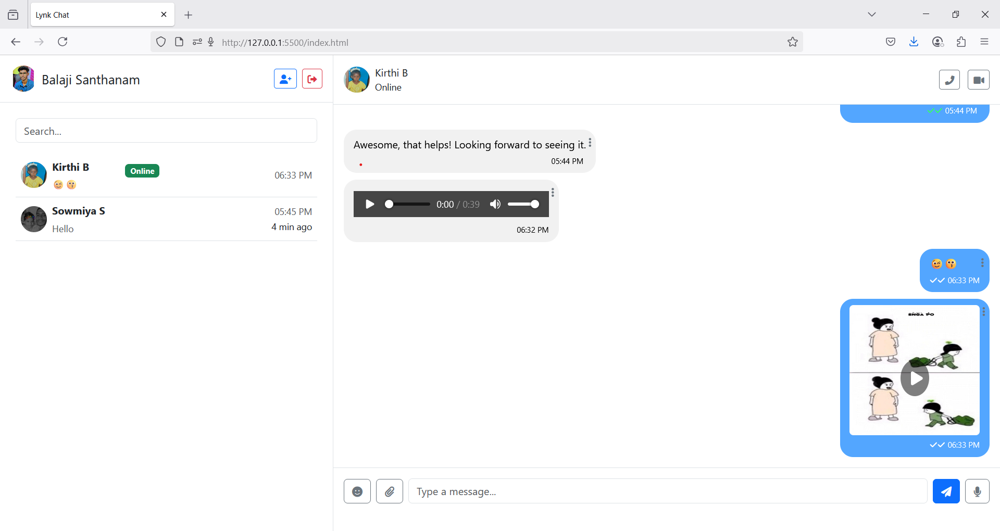

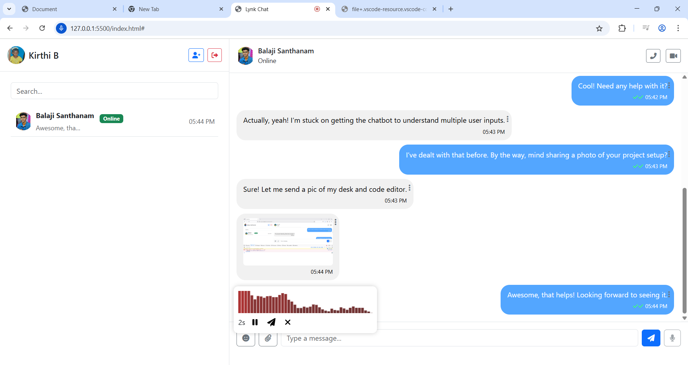

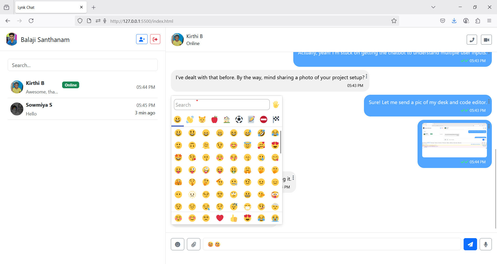

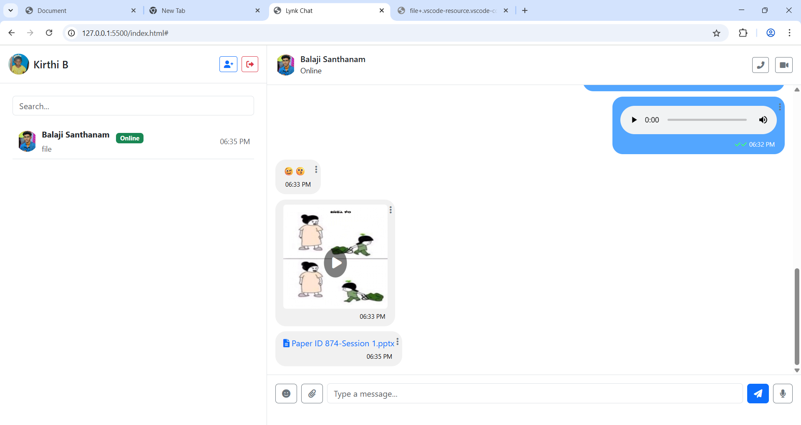

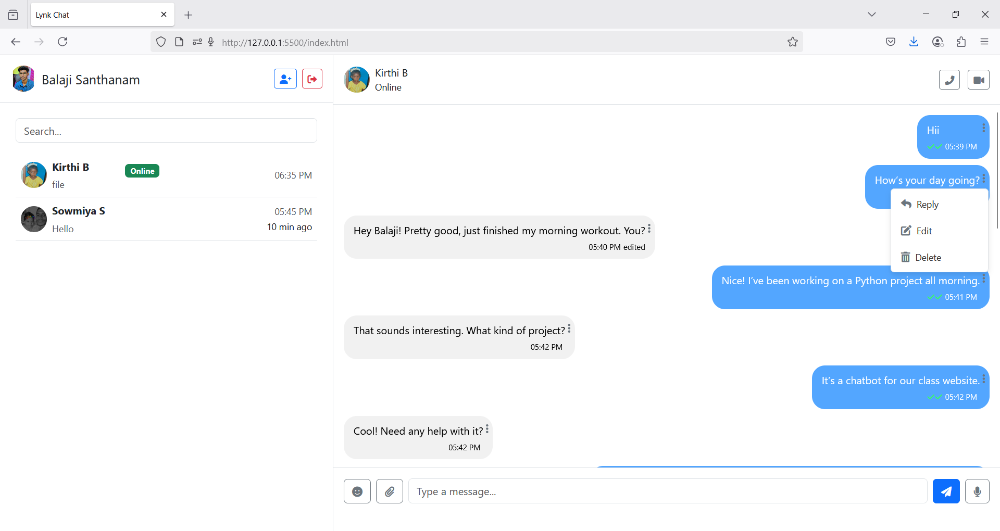

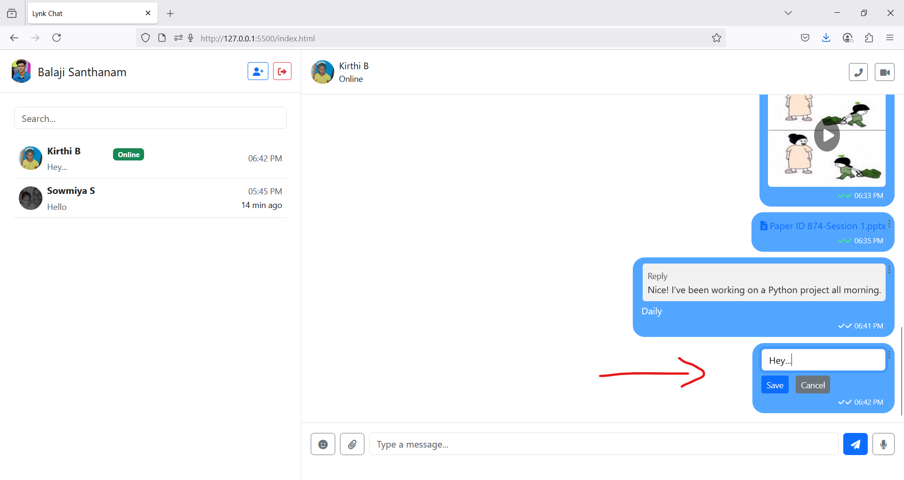

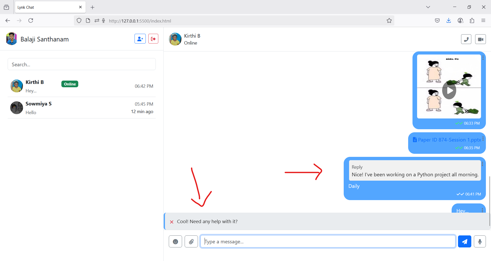

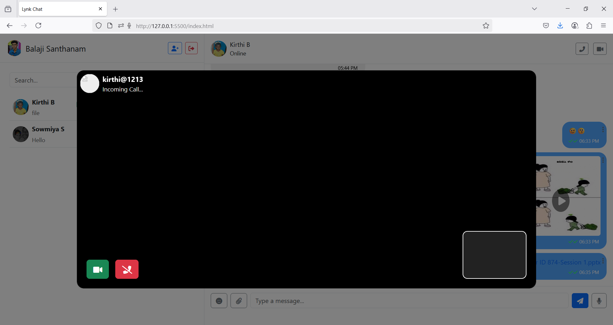

---

## License

MIT License

---

## Credits

- [Bootstrap](https://getbootstrap.com/)
- [FontAwesome](https://fontawesome.com/)
- [Cropper.js](https://fengyuanchen.github.io/cropperjs/)
- [Google Fonts](https://fonts.google.com/)

---

**Enjoy chatting with Lynk Chat!**
